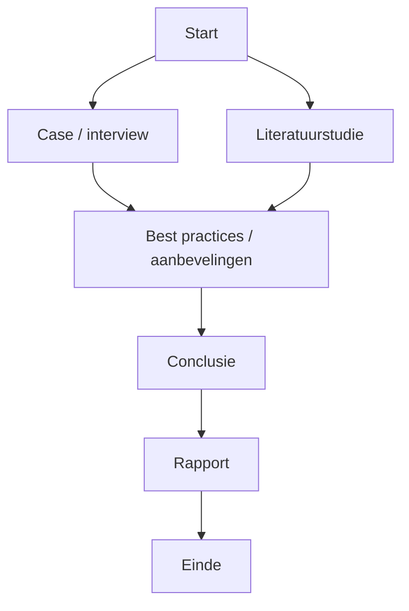
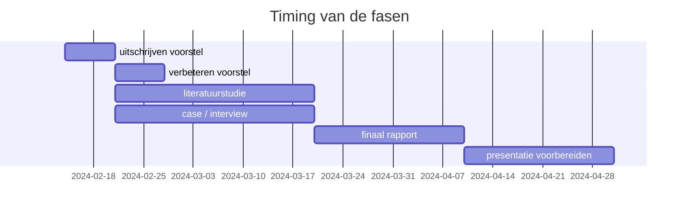

## Flowchart

```mermaid
flowchart
    A[Start] --> B[Literatuurstudie]
    A --> C[Case / interview]
    C --> D[Best practices / aanbevelingen]
    B --> D
    D --> E[Conclusie]
    E --> F[Rapport]
    F --> G[Einde]
```

## GANTT-chart

```mermaid
gantt
dateFormat  YYYY-MM-DD
title Timing van de fasen

uitschrijven voorstel           :des1, 2024-02-14, 2024-02-21
verbeteren voorstel             :des2, 2024-02-21, 2024-02-28
literatuurstudie                :des3, after des1, 28d
case / interview                :des4, after des1, 28d
finaal rapport                  :des5, after des4, 21d
presentatie voorbereiden        :des6, after des5, 21d

```
